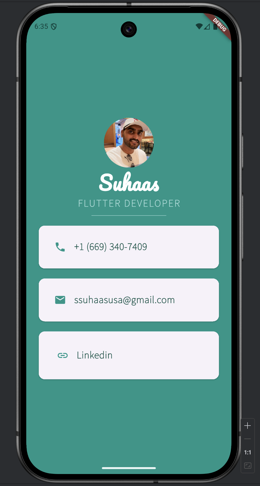
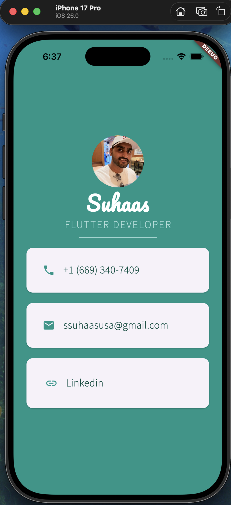

# Mi Card 🪪

Welcome to Mi Card, the coolest digital business card in the Flutterverse! Say goodbye to flimsy paper cards that get lost in the wallet abyss. This app is your personal digital identity, beautifully crafted and always ready to impress.

## 🌟 About This Project

Mi Card is a simple yet elegant Flutter application that showcases a personal business card. It's a great beginner-friendly project that demonstrates the power of Flutter's UI toolkit to create beautiful, custom layouts. The app displays a profile picture, name, title, and contact information, including phone, email, and a tappable link to a professional profile.

## ✨ Features

*   **Stylish Profile Display:** A circular avatar for your picture.
*   **Custom Fonts:** Elegant fonts (`Pacifico` and `SourceSans3`) for a professional look.
*   **Contact Information:** Cleanly presented cards for your phone number and email address.
*   **Interactive Links:** A tappable card that opens your LinkedIn profile.
*   **Cross-Platform:** Built with Flutter, it runs beautifully on both Android and iOS from a single codebase.

## 📸 Screenshots

Show off your awesome business card here!

| Android | iOS |
| :---: | :---: |
|   |   |

## 🚀 Getting Started

To get a local copy up and running, follow these simple steps.

1.  Clone the repo:
    ```sh
    git clone https://github.com/your_username/mi-card.git
    ```
2.  Navigate to the project directory:
    ```sh
    cd mi-card
    ```
3.  Install dependencies:
    ```sh
    flutter pub get
    ```
4.  Run the app:
    ```sh
    flutter run
    ```

---

Made with ❤️ and a whole lot of Flutter!
